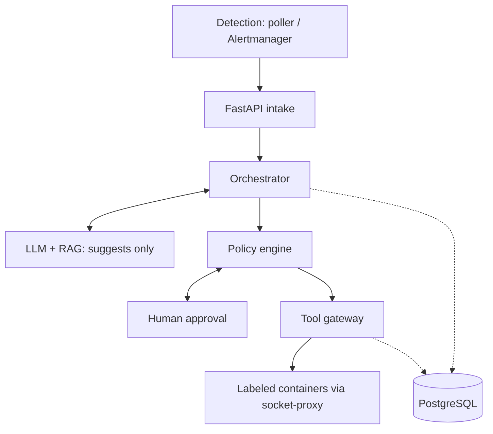

# System overview

```mermaid
flowchart TD
  D[Detection: poller / Alertmanager] --> A[FastAPI intake]
  A --> O[Orchestrator]
  O <--> L[LLM + RAG: suggests only]
  O --> P[Policy engine]
  P <--> H[Human approval]
  P --> G[Tool gateway]
  G --> C[Labeled containers via socket-proxy]
  O -.-> DB[(PostgreSQL)]
  G -.-> DB
```

The LLM never executes anything. It only proposes an `action_id`;
the policy engine decides.
