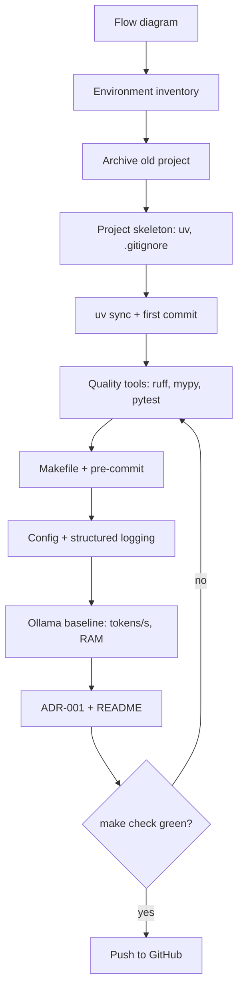

# Phase 1 flow: foundation and Ollama baseline

```mermaid
flowchart TD
  A[Flow diagram] --> B[Environment inventory]
  B --> C[Archive old project]
  C --> D[Project skeleton: uv, .gitignore]
  D --> E[uv sync + first commit]
  E --> F[Quality tools: ruff, mypy, pytest]
  F --> G[Makefile + pre-commit]
  G --> H[Config + structured logging]
  H --> I[Ollama baseline: tokens/s, RAM]
  I --> J[ADR-001 + README]
  J --> K{make check green?}
  K -- yes --> L[Push to GitHub]
  K -- no --> F
```
