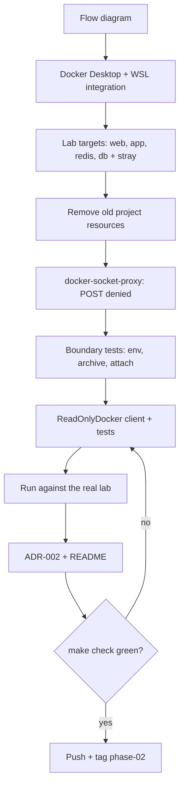

# Phase 2 flow: read-only Docker access and lab

```mermaid
flowchart TD
  A[Flow diagram] --> B[Docker Desktop + WSL integration]
  B --> C[Lab targets: web, app, redis, db + stray]
  C --> D[Remove old project resources]
  D --> E[docker-socket-proxy: POST denied]
  E --> F[Boundary tests: env, archive, attach]
  F --> G[ReadOnlyDocker client + tests]
  G --> H[Run against the real lab]
  H --> I[ADR-002 + README]
  I --> J{make check green?}
  J -- yes --> K[Push + tag phase-02]
  J -- no --> G
```
